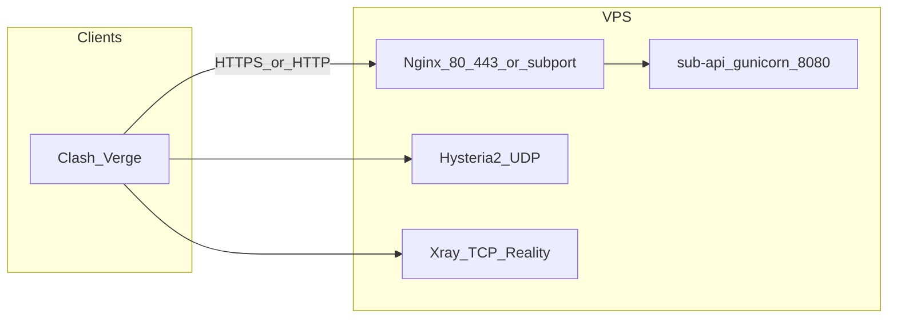

# 一键部署说明（deploy.sh）

面向 Debian/Ubuntu，**root** 执行：`sudo bash deploy.sh`

## 架构总览

| 组件 | 作用 | 监听 |
|------|------|------|
| **Nginx** | 反代订阅 `/sub`、`/health` 到本机 gunicorn | 域名模式 80/443；IP 模式为所选 `sub_port` |
| **sub-api** | Flask 生成 Clash YAML | `127.0.0.1:8080` |
| **Hysteria2** | QUIC 代理，密码为用户 UUID | `hy2_port` UDP |
| **Xray** | VLESS + REALITY（仅域名模式） | `xray_port` TCP |

状态与数据目录：`/opt/vpn-stack/`（`state.json`、`tokens.json`、`params.json`、`sub-api/app.py`）。

## 安装流程（脚本实际顺序）

1. 交互选择 **域名模式** 或 **纯 IP 模式**，输入端口等参数。
2. `apt` 安装依赖（含 `nginx`、`ufw`、`python3` 等），下载 **Xray / Hysteria2** 二进制。
3. 生成证书（Let's Encrypt 或自签）。
4. 写入 **Xray** 配置：`Environment=XRAY_LOCATION_ASSET=/etc/xray`，日志目录属主 `nobody`，`xray run -config ... -test` 通过后才继续。
5. 部署 **sub-api**（venv + gunicorn）。
6. 配置 **Nginx** 反代。
7. 写入 **`state.json`**，**ufw 放行**（若已安装 ufw）。
8. **`_seed_first_user`**：写入首个用户到 `tokens.json`、更新 Xray `clients`、`_rebuild_hy2_config`（HY2 使用 **string masquerade**，避免反代自身域名导致报错）。
9. **启动** `xray`（域名） / `hysteria2` / `sub-api` / `nginx`。
10. **`_connectivity_test`**：检查 systemd、`ss` 监听、`/health`、`/sub` YAML。
11. 打印 **首个用户订阅 URL**。

## 云安全组（必做）

脚本无法修改云厂商控制台，**必须在安全组放行**：

- **Hysteria2**：与 `state.json` 中 `hy2_port` 一致的 **UDP** 入站。
- **Xray（域名模式）**：`xray_port` 的 **TCP** 入站。
- **订阅**：域名模式 **TCP 80/443**；IP 模式为 **`sub_port` 的 TCP**。

仅放行 TCP 不放行 UDP 会导致 **Hysteria2 一直 timeout**。

## 常见问题

### Xray 起不来（exit 23）

已处理：日志目录属主、`XRAY_LOCATION_ASSET`、`config.json` 属主 `nobody`、安装时执行配置测试。若仍失败：`journalctl -u xray -n 50`。

### Hysteria2 报 HTTP reverse proxy / masquerade

已处理：域名模式不再对 `https://本机域名` 做 proxy masquerade，改为与 IP 模式一致的 string 伪装。

### 订阅 502

gunicorn 未监听 `127.0.0.1:8080`：`systemctl status sub-api`，`journalctl -u sub-api`。

### ufw 未 enable

脚本会 `ufw allow` 写入规则；`ufw` 未 enable 时本机默认不拦截，**云安全组仍须手动放行**。

## 卸载

菜单选项 **6** 或参考脚本中 `do_uninstall`（会删除 `/opt/vpn-stack`、`/usr/local/bin/xray`、`hysteria` 等）。
